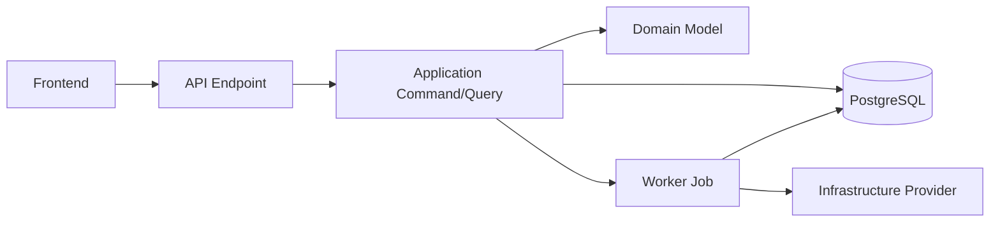

# Feature Implementation Planning for Engram

## Purpose

Use this project-local skill to create detailed implementation plans for Engram features before writing code.

The plan must respect the Engram product direction:

```text
Source
-> Processing Pipeline
-> Knowledge Atoms
-> Deduplication and Relations
-> Knowledge Graph
-> SRS Review
-> Retention Analytics
-> Markdown Export
```

Do not plan features as generic CRUD screens. Always identify how the feature affects the pipeline, atom lifecycle, graph, SRS, analytics, or user-owned knowledge state.

## When To Use

Use this when the user asks to:

- break down a feature;
- create an implementation plan;
- turn a PRD into tasks;
- plan a vertical slice;
- estimate affected modules/layers;
- prepare a development roadmap for one feature.

Do not use this for small obvious bug fixes unless the user asks for a plan.

## Required Context

Before planning, read the relevant project files:

- `AGENTS.md`
- `docs/product/mvp-slices.md`
- `docs/architecture/overview.md`
- `docs/architecture/domain-model.md`
- `docs/architecture/ai-pipeline.md` when the feature touches extraction, embeddings, or LLMs
- `docs/architecture/srs-engine.md` when the feature touches review or memory scheduling
- `docs/architecture/knowledge-graph.md` when the feature touches graph data or visualization
- `docs/skills/backend/clean-architecture.md` when the feature touches ASP.NET Core backend architecture

If a feature conflicts with MVP scope, call that out clearly and propose the smallest MVP-safe version.

## Output Location

When asked to create a plan file, save it here:

```text
docs/ways-of-work/plans/{epic-name}/{feature-name}/implementation-plan.md
```

Use lowercase kebab-case for `{epic-name}` and `{feature-name}`.

If the user only asks for advice in chat, provide the plan in the response and do not create files unless useful.

## Plan Format

Create the implementation plan in Markdown with these sections.

### 1. Goal

Describe the feature goal in 3-5 sentences.

Include:

- user value;
- product flow affected;
- MVP or post-MVP status;
- expected demo outcome.

### 2. Scope

List what is included and excluded.

Make the exclusions explicit when the feature risks expanding beyond MVP.

### 3. User Flow

Describe the user's path through the feature.

For Engram, prefer vertical flows like:

```text
User action
-> API command
-> background job if needed
-> domain state changes
-> UI feedback
```

### 4. Affected Modules

Identify affected modules:

- Identity
- Sources
- Processing
- KnowledgeAtoms
- Deduplication
- KnowledgeGraph
- Review
- Analytics
- Export

### 5. Affected Layers

Identify affected layers:

- Domain
- Application
- Infrastructure
- Api
- Worker
- Frontend
- Docker/Infrastructure

For backend work, align with `docs/skills/backend/clean-architecture.md`.

### 6. Domain Model Changes

List new or changed entities, value objects, enums, status transitions, and invariants.

Include user ownership rules where relevant.

### 7. Backend Plan

Break down:

- commands and queries;
- handlers;
- domain methods;
- interfaces;
- infrastructure implementations;
- API endpoints/contracts;
- background jobs;
- validation and error handling.

Endpoints must stay thin. Long-running work must be queued.

### 8. Database Plan

Include:

- tables/entities affected;
- field changes;
- indexes;
- pgvector usage if embeddings are involved;
- migrations;
- data integrity constraints.

Add a Mermaid ER diagram when the feature changes the data model materially.

### 9. AI and Pipeline Plan

Use this section only when relevant.

Cover:

- prompt/input contract;
- structured output schema;
- validation rules;
- provider abstraction;
- fake/mock implementation;
- source traceability;
- error handling;
- retry behavior.

### 10. Frontend Plan

Cover:

- screens and routes;
- components;
- state management;
- React Query hooks;
- forms and validation;
- loading/error/empty states;
- graph or chart behavior if relevant.

The UI should be the real app workflow, not a landing page.

### 11. Security and Privacy

Cover:

- authentication;
- authorization;
- user ownership checks;
- input limits;
- secret handling;
- logging constraints.

### 12. Testing Plan

Include:

- domain unit tests;
- application handler tests;
- integration tests;
- frontend tests if relevant;
- fake AI/embedding providers;
- edge cases.

### 13. Implementation Steps

Provide an ordered checklist.

Group by vertical slice when possible:

```text
Backend domain -> Application use case -> API -> Frontend -> Tests
```

### 14. Risks and Tradeoffs

List the main risks, shortcuts, and follow-up work.

Call out any deferred post-MVP behavior.

## Mermaid Guidance

Use Mermaid diagrams when they clarify architecture or data shape.

For feature architecture, prefer:



For database changes, prefer `erDiagram`.

## Final Rule

A good Engram implementation plan should make it obvious:

- what to build first;
- what not to build yet;
- which layer owns each responsibility;
- how the feature proves the core product flow;
- how it will be tested.
